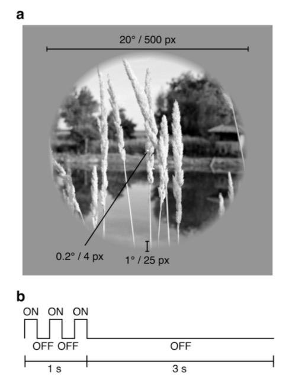
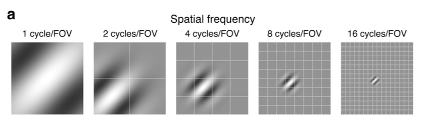
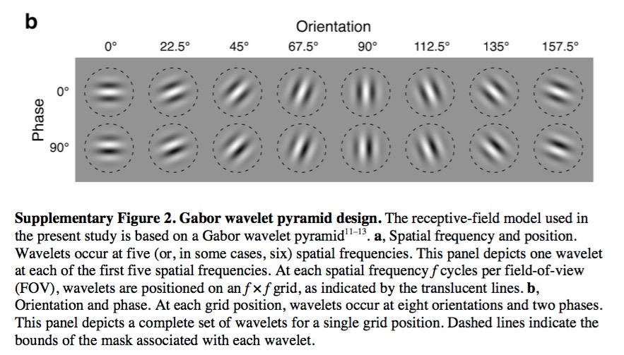
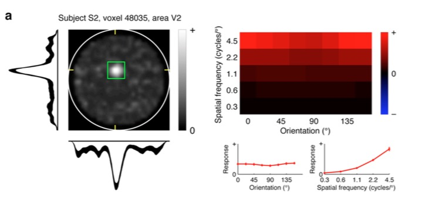
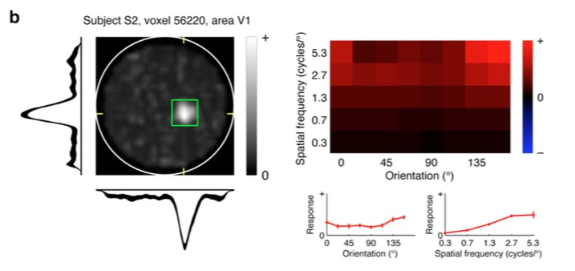
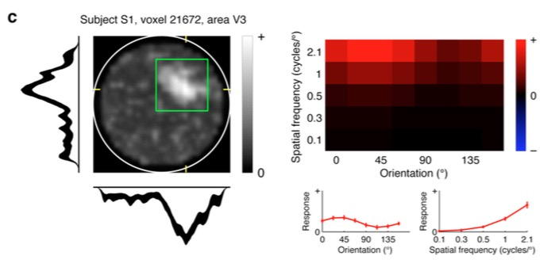
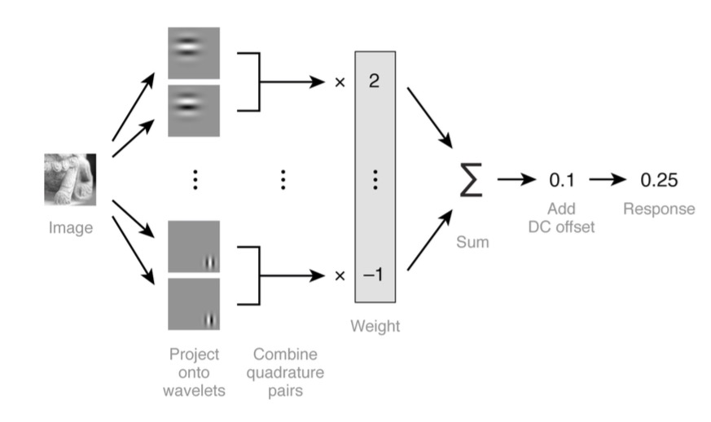
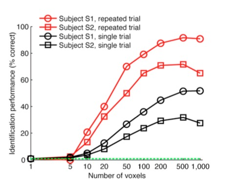
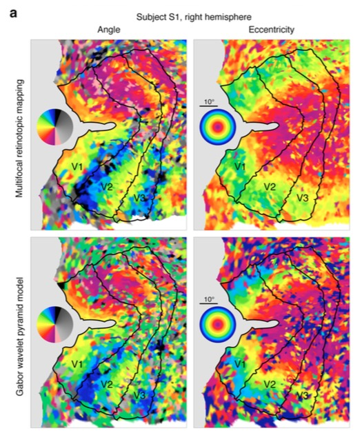
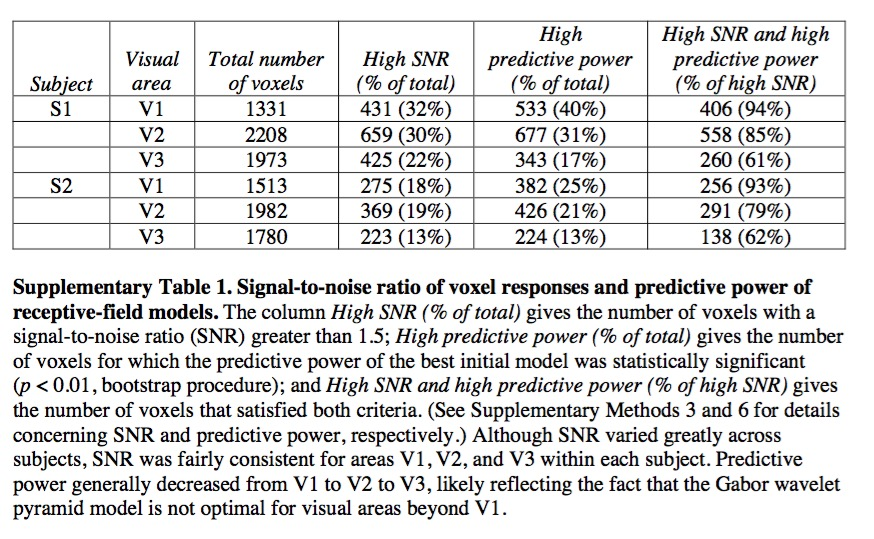

```{r setup, include=FALSE}
knitr::opts_chunk$set(echo = FALSE)
```

# preliminaries

## Topics

- Visual processing in V1
- Object processing
- Perception vs. action
- <span class="blue">"Reading" the mind</span>

## Resources

- Course web site: [psu-psychology.github.io/neuro-521-spring-2017](https://psu-psychology.github.io/neuro-521-spring-2017/schedule.html)

# main event

## Today's reading

Kay, K. N., Naselaris, T., Prenger, R. J., & Gallant, J. L. (2008). Identifying natural images from human brain activity. *Nature*, *452*(7185), 352–355. https://doi.org/10.1038/nature06713. [Supplemental materials](http://www.nature.com/nature/journal/v452/n7185/extref/nature06713-s1.pdf).

## From static images to dynamic patterns {.smaller}

<iframe width="560" height="315" src="https://www.youtube.com/embed/6FsH7RK1S2E" frameborder="0" allowfullscreen></iframe>

Nishimoto, S., Vu, A. T., Naselaris, T., Benjamini, Y., Yu, B., & Gallant, J. L. (2011). Reconstructing Visual Experiences from Brain Activity Evoked by Natural Movies. Current Biology, 21(19), 1641–1646. <https://doi.org/10.1016/j.cub.2011.08.031>.

---

<div class="centered">

</div>

---

<div class="centered">

</div>

---

<div class="centered">

</div>

---

<div class="centered">

</div>

---

<div class="centered">

</div>

---

<div class="centered">

</div>

---

<div class="centered">

</div>

---

<div class="centered">

</div>

---

<div class="centered">

</div>

---
<div class="centered">

</div>


