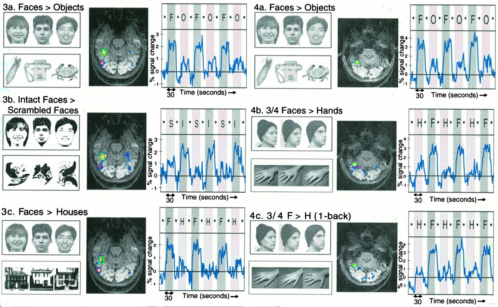

```{r setup, include=FALSE}
knitr::opts_chunk$set(echo = FALSE)
```

# preliminaries

<!-- --- -->

<!-- <iframe width="560" height="315" src="https://www.youtube.com/embed/nvXuq9jRWKE" frameborder="0" allowfullscreen></iframe> -->

<!-- <div class="notes"> -->
<!-- Lichtman on connectome. -->
<!-- </div> -->

## Topics

- What does visual cortex do?
- **Face processing**
- Perception vs. action
- "Reading" the mind via fMRI
- Does neuroscience need behavior?

## Resources

- Course web site: [psu-psychology.github.io/neuro-521-spring-2018](https://psu-psychology.github.io/neuro-521-spring-2018/schedule.html)

# main event

## Today's reading

Kanwisher, N., McDermott, J., & Chun, M. M. (1997). The fusiform face area: a module in human extrastriate cortex specialized for face perception. *The Journal of Neuroscience: The official journal of the Society for Neuroscience*, *17*(11), 4302–4311. Retrieved from https://www.ncbi.nlm.nih.gov/pubmed/9151747

## Questions to ponder

- What do Kanwisher et al. mean when they say that fusiform cortex is i) a module that is ii) specialized for face perception? 
- What is an alternative view?

---

<div class="centered">
<a href="http://www.jneurosci.org/content/17/11/4302">

</a>

[Kanwisher et al., 1997](http://www.jneurosci.org/content/17/11/4302)
</div>

---

<div class="centered">


[Kanwisher et al., 1997](http://www.jneurosci.org/content/17/11/4302)
</div>

---

<div class="centered">


[Kanwisher et al., 1997](http://www.jneurosci.org/content/17/11/4302)
</div>

## Alternative views

<div class="centered">


[Behrmann & Plaut, 2013](https://doi.org/10.1016/j.tics.2013.03.007)
</div>

<!-- Scrolling final reference page -->
<!-- http://stackoverflow.com/q/38260799 -->
<style>
slides > slide { overflow: scroll; }
slides > slide:not(.nobackground):before {
  background: none;
  }
slides > slide:not(.nobackground):after {
  content: '';
  background: none;
  }
}
</style>

## Faces vs. buildings

<div class="centered">


[Behrmann & Plaut, 2013](https://doi.org/10.1016/j.tics.2013.03.007)
</div>

<!-- ## Methods -->

<!-- - Stimuli -->
<!--     + Visual stimuli -->
<!--     + Arousing and aversive -->

<!-- ## Findings -->

<!-- - 48/497 STS cells responses to faces 2-10x larger -->
<!-- - 80-180 ms latencies -->
<!-- - 26/37 cells == reponsive to "transformed" faces (Fig 7) -->
<!-- - Color, size, orientation insensitive, but 60% sensitive to profile change -->
<!-- - Faces evoke larger GSR -->

<!-- ## Questions -->

<!-- - Why do cells respond inconsistently across repeated presentations? -->
<!-- - Do you agree with claims about sensory vs. motor/arousal responses? -->
<!-- - Inputs from IT cortex -->

<!-- ## More questions... -->

<!-- - How to build a face detector from simple and complex cells? -->
<!-- - What other kinds of "detectors" might there be? -->
<!-- - What's the ["grandmother cell" hypothesis](https://en.wikipedia.org/wiki/Grandmother_cell), and how does this work comport with it? -->

<!-- ## Other perspectives -->

<!-- - Rolls, E. T., Judge, S. J., & Sanghera, M. K. (1977). Activity of neurones in the inferotemporal cortex of the alert monkey. Brain Research, 130(2), 229–238. <https://doi.org/10.1016/0006-8993(77)90272-4> -->
<!-- - Servos, P., Osu, R., Santi, A., & Kawato, M. (2002). The Neural Substrates of Biological Motion Perception: an fMRI Study. Cerebral Cortex, 12(7), 772–782. <https://doi.org/10.1093/cercor/12.7.772> -->
<!--     + [Bio-motion demos](https://www.biomotionlab.ca/Demos/BMLwalker.html) -->
    
<!-- --- -->

<!-- <iframe src="https://www.biomotionlab.ca/Demos/BMLwalker.html"> -->
<!-- </iframe> -->

<!-- --- -->

<!-- <a href="http://webvision.med.utah.edu/book/part-ix-psychophysics-of-vision/the-primary-visual-cortex/"> -->
<!-- <div class="centered"> -->
<!--  -->
<!-- </a> -->
<!-- </div> -->

<!-- Van Essen, D. C., Anderson, C. H., & Felleman, D. J. (1992). Information Processing in the Primate Visual System: An Integrated Systems Perspective. Science; Washington, 255(5043), 419. -->

<!-- ## Inputs to STS -->

<!-- - Gallant, J. L., Braun, J., & Essen, D. V. (1993). Selectivity for polar, hyperbolic, and Cartesian gratings in macaque visual cortex. Science, 259(5091), 100–103. <https://doi.org/10.1126/science.8418487> -->
<!-- - Roe, A. W., Chelazzi, L., Connor, C. E., Conway, B. R., Fujita, I., Gallant, J. L., … Vanduffel, W. (2012). Toward a Unified Theory of Visual Area V4. Neuron, 74(1), 12–29. <https://doi.org/10.1016/j.neuron.2012.03.011>. -->

## Relate to [convolutional neural networks](https://en.wikipedia.org/wiki/Convolutional_neural_network)?

<div class="centered">

</div>

## ... to prosopagnosia?

<iframe width="560" height="315" src="https://www.youtube.com/embed/vwCrxomPbtY" frameborder="0" allowfullscreen></iframe>
