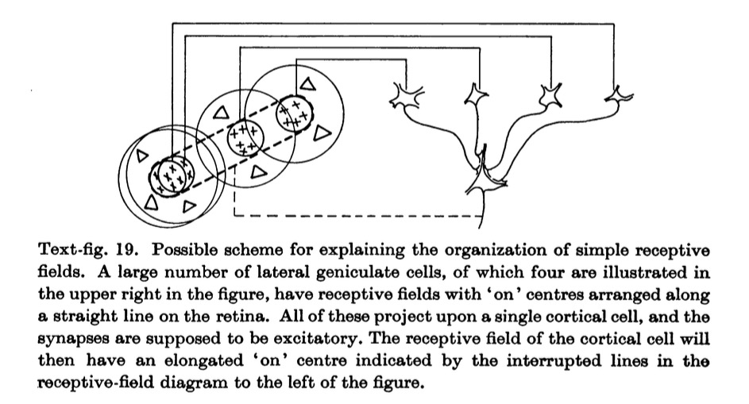
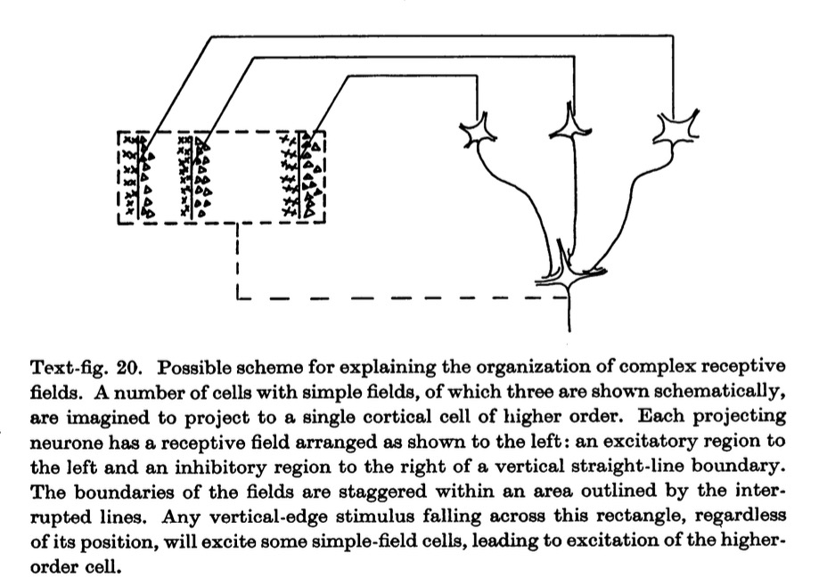

```{r setup, include=FALSE}
knitr::opts_chunk$set(echo = FALSE)
```

# preliminaries

## Topics

- What does visual cortex do?
- Face processing
- Perception vs. action
- "Reading" the mind via fMRI
- Does neuroscience need behavior?

## Resources

- Course web site: [psu-psychology.github.io/neuro-521-spring-2018](https://psu-psychology.github.io/neuro-521-spring-2018/schedule.html)

## About me

- Associate Professor of Psychology
- Founding Director of Human Imaging at Penn State's [SLEIC](http://imaging.psu.edu)
- Co-founder and Co-Director of the [Databrary.org](http://databrary.org) digital library
- A.B., Cognitive Science, Brown; M.S. & Ph.D., Cognitive Neuroscience, Carnegie Mellon University
- Folk music, theatre, poetry, cycling, hiking, paddling, amateur radio (K3ROG)

## Research interests

- Development of complex motion processing
- Open, transparent, reproducible science practices
- Technological innovation in behavioral, neural science

# main event

## Today's reading

- Wandell, B. A., Dumoulin, S. O., & Brewer, A. A. (2007). Visual field maps in human cortex. *Neuron*, *56*(2), 366–383. Retrieved from http://dx.doi.org/10.1016/j.neuron.2007.10.012

## Questions to ponder

- What are visual field maps?
- How are they measured or acquired? 
- How does this method compare with single unit recordings? 
- What do visual field maps tell us about the function of visual cortex?

---

<div class="centered">

</div>

[Wandell et al.](http://dx.doi.org/10.1016/j.neuron.2007.10.012), Fig 1

---

<div class="centered">


<http://cns.bu.edu/~arash/animation.gif>
</div>

---

<div class="centered">


[Wandell et al.](http://dx.doi.org/10.1016/j.neuron.2007.10.012), Fig 2

---

<iframe width="560" height="315" src="https://www.youtube.com/embed/3_ZuXjxtxU4" frameborder="0" allow="autoplay; encrypted-media" allowfullscreen></iframe>

### Expanding ring/annulus

---

<iframe width="560" height="315" src="https://www.youtube.com/embed/tb1Oia-lCEs" frameborder="0" allow="autoplay; encrypted-media" allowfullscreen></iframe>

### Rotating wedge

---

<div class="centered">


[Wandell et al.](http://dx.doi.org/10.1016/j.neuron.2007.10.012), Fig 3
</div>


---

<div class="centered">


[Wandell et al.](http://dx.doi.org/10.1016/j.neuron.2007.10.012), Fig 4
</div>

---

<div class="centered">


[Wandell et al.](http://dx.doi.org/10.1016/j.neuron.2007.10.012), Fig 5
</div>

---

<div class="centered">


[Wandell et al.](http://dx.doi.org/10.1016/j.neuron.2007.10.012), Fig 6
</div>

---

<div class="centered">


[Wandell et al.](http://dx.doi.org/10.1016/j.neuron.2007.10.012), Fig 8
</div>

---

<div class="centered">


[Wandell et al.](http://dx.doi.org/10.1016/j.neuron.2007.10.012), Fig 9
</div>


---

<div class="centered">


[Wandell et al.](http://dx.doi.org/10.1016/j.neuron.2007.10.012), Fig 10
</div>


<!-- --- -->

<!-- <iframe width="560" height="315" src="https://www.youtube.com/embed/IOHayh06LJ4" frameborder="0" allowfullscreen></iframe> -->

<!-- --- -->

<!-- <iframe width="560" height="315" src="https://www.youtube.com/embed/8VdFf3egwfg" frameborder="0" allowfullscreen></iframe> -->

<!-- ## Other questions to ponder -->

<!-- - What's the goal of visual neuroscience? -->
<!-- - What's a receptive field? -->
<!-- - What made 'simple' cells simple? -->
<!--     + How were cortical 'simple' cells different from LGN and retinal cells? -->
<!-- - What made 'complex' cells complex? -->

<!-- ## More questions to ponder -->

<!-- - How does the size of receptive fields vary? -->
<!-- - What is direction selectivity? -->
<!-- - What is ocular dominance? -->

<!-- ## Key points -->

<!--   > "...with the exception of afferent fibres from the lateral geniculate body we have found no units with concentric 'on'-centre or 'off'-centre fields." p.109 -->

<!--   > "...By trial and error with many shapes of stimulus it was discovered that the cell's firing could be influenced by a horizontally oriented slit..." p. 114 -->

<!--   > "In describing simple fields it has already been noted that moving stimuli were often more effective than stationary ones. This was also true of cells with complex fields." p. 121 -->

<!-- --- -->

<!--   > "...in both geniculate and cortex the field dimensions tend to increase with distance from the area centralis, and that they differ even for a given location in the retina." p. 122 -->

<!--   > "...the only differences ever seen between the two fields were related to eye dominance: identical stimuli to the two eyes did not necessarily evoke equally strong responses from a given cell." p. 124 -->

<!--   > "...the striate cortex is divided into discrete regions within which the cells have a common receptive-field axis orientation." p. 133 -->

<!-- --- -->

<!--   > "Cells with simple fields were most numerous in layers 3, 4 and 6. Especially interesting is the apparent rarity of complex fields in layer 4, where simple fields were so abundant." p. 139 -->

<!--   > "We may tentatively look upon each column as a functional unit of cortex, within which simple fields are elaborated and then in turn synthesized into complex fields." p. 144 -->

<!-- --- -->

<!-- <div class="centered"> -->
<!--  -->
<!-- </div> -->

<!-- <div class="notes"> -->
<!-- Figure 19. How to build an orientation-selective cell from center-surround inputs. -->
<!-- </div> -->

<!-- --- -->

<!-- <div class="centered"> -->
<!--  -->
<!-- </div> -->

<!-- <div class="notes"> -->
<!-- Figure 20. How to build an orientation-selective cell from center-surround inputs. -->
<!-- </div> -->

<!-- ## Cortical hypercolumn -->

<!-- <div class="centered"> -->
<!-- <a href="http://thebrain.mcgill.ca/flash/a/a_02/a_02_cl/a_02_cl_vis/a_02_cl_vis.html"> -->
<!--  -->
<!-- </a> -->
<!-- </div> -->

## Next time...

- Face processing
- Kanwisher, N., McDermott, J., & Chun, M. M. (1997). The fusiform face area: a module in human extrastriate cortex specialized for face perception. *The Journal of Neuroscience: The official journal of the Society for Neuroscience*, *17*(11), 4302–4311. Retrieved from https://www.ncbi.nlm.nih.gov/pubmed/9151747