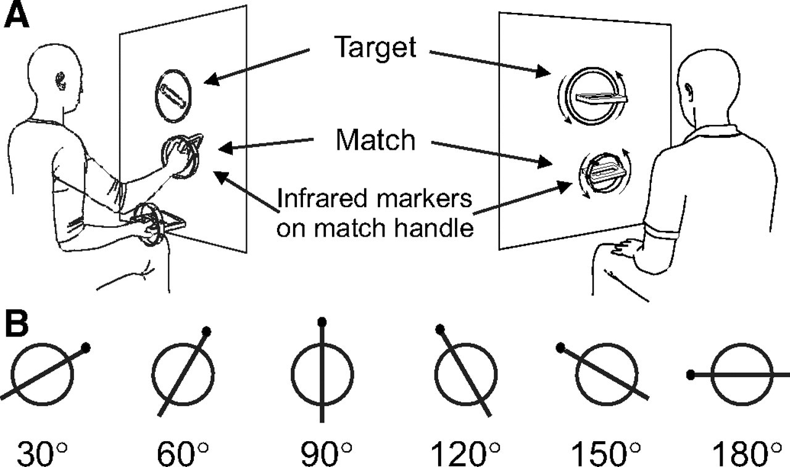

```{r setup, include=FALSE}
knitr::opts_chunk$set(echo = FALSE)
```

# preliminaries

## Topics

- Visual processing in V1
- Object processing
- **Perception vs. action**
- "Reading" the mind via fMRI
- Does neuroscience need behavior?

## Resources

- Course web site: [psu-psychology.github.io/neuro-521-spring-2018](https://psu-psychology.github.io/neuro-521-spring-2018/schedule.html)

## More hints on papers

- Introductory sentence can start with when, if, or although.
- Introductory paragraph should state your thesis.
- Body should include i) what the author(s) did, and ii) your evaluation of what they did.
- Concluding paragraph should summarize your argument.

# main event

## Today's reading

Goodale, M. A., Milner, A. D., Jakobson, L. S., & Carey, D. P. (1991). A neurological dissociation between perceiving objects and grasping them. Nature, 349(6305), 154–156. <https://doi.org/10.1038/349154a0>

---

<iframe width="560" height="315" src="https://www.youtube.com/embed/Te4xmwI1Y_k" frameborder="0" allowfullscreen></iframe>

"Visual Routes to Knowledge and Action: (almost) 25 Years of Two Visual Systems, Mel Goodale"

## Task

<div class="centered">
<a href="http://jn.physiology.org/content/99/4/1653">

</a>
</div>

## Inspiration

<div class="centered">
<a href="http://www.cse.iitk.ac.in/users/amit/books/goodale-2004-sight-unseen-exploration.html">

</a>
</div>

<div class="notes">
"Marie-Thérèse Perenin and Alain Vighetto discovered that patients with 'optic ataxia' not only have problems reaching to point to something accurately, but also tend to direct their hand at the wrong angle when trying to pass it through a slot. The same patients, however, often have no problem describing the orientation of the slot in words"
</div>

## Questions

- How do Goodale et al. distinguish between "perceiving objects" and the perceptual processing required to grasp them? 
- Is this evidence for separable processing streams devoted to "perception" and "action"?

## Other questions

- What are the strengths of neuropsychological methods?
- What role do psychological/behavioral theories have on studies of brain function?

## Two streams hypothesis

- Schneider, G. E. (1969). Two Visual Systems. Science, 163(3870), 895–902. <https://doi.org/10.1126/science.163.3870.895>
- Mishkin, M., Ungerleider, L. G., & Macko, K. A. (1983). Object vision and spatial vision: two cortical pathways. Trends in Neurosciences, 6, 414–417. <https://doi.org/10.1016/0166-2236(83)90190-X>
- Ungerleider, L. G., & Pessoa, L. (2008). What and where pathways. Scholarpedia, 3(11), 5342. <https://doi.org/10.4249/scholarpedia.5342>

## What and where pathways {.smaller} 

<div class="centered">
<a href="https://doi.org/10.4249/scholarpedia.5342">

</a>

## More recent views

- Kravitz, D. J., Saleem, K. S., Baker, C. I., & Mishkin, M. (2011). A new neural framework for visuospatial processing. Nature Reviews Neuroscience, 12(4), 217–230. <https://doi.org/10.1038/nrn3008>
- Freud, E., Plaut, D. C., & Behrmann, M. (2016). “What” Is Happening in the Dorsal Visual Pathway. Trends in Cognitive Sciences, 20(10), 773–784.    <https://doi.org/10.1016/j.tics.2016.08.003>

## Parallel processing in vision {.smaller}

<a href="http://webvision.med.utah.edu/book/part-ix-psychophysics-of-vision/the-primary-visual-cortex/">
<div class="centered">

</a>
</div>

Van Essen, D. C., Anderson, C. H., & Felleman, D. J. (1992). Information Processing in the Primate Visual System: An Integrated Systems Perspective. Science; Washington, 255(5043), 419.

