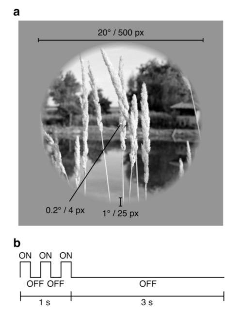
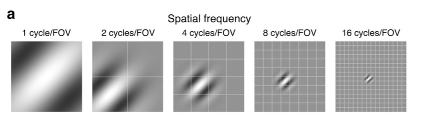
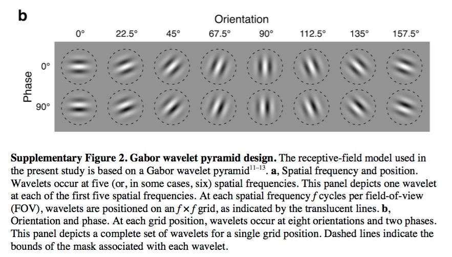
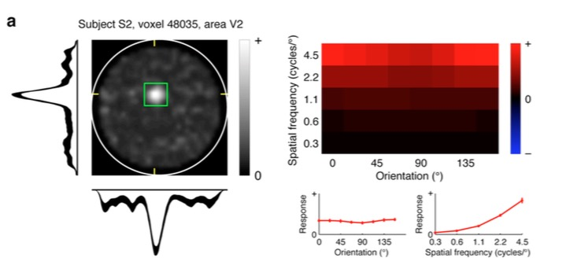
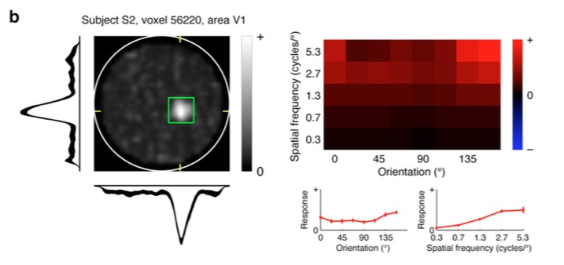
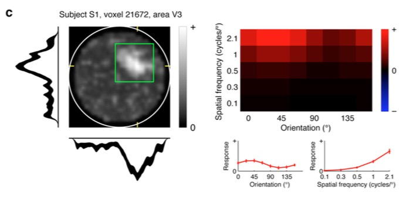
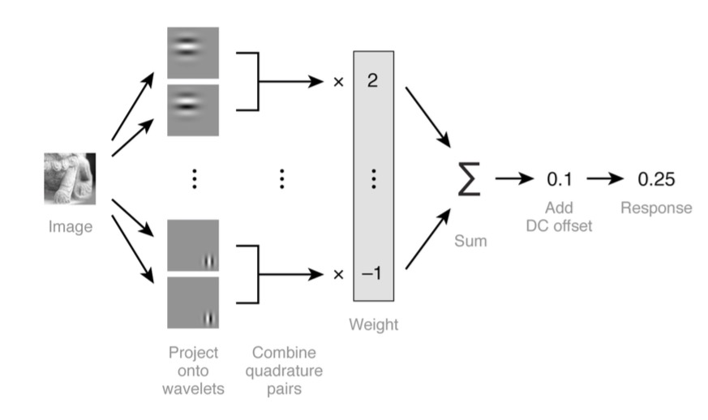
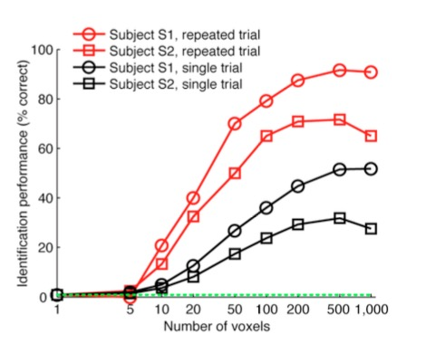
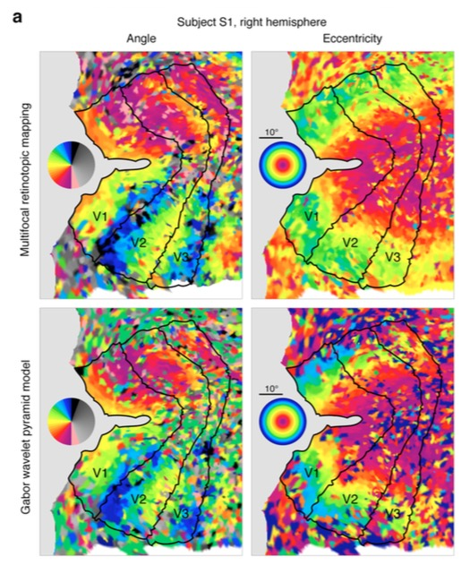
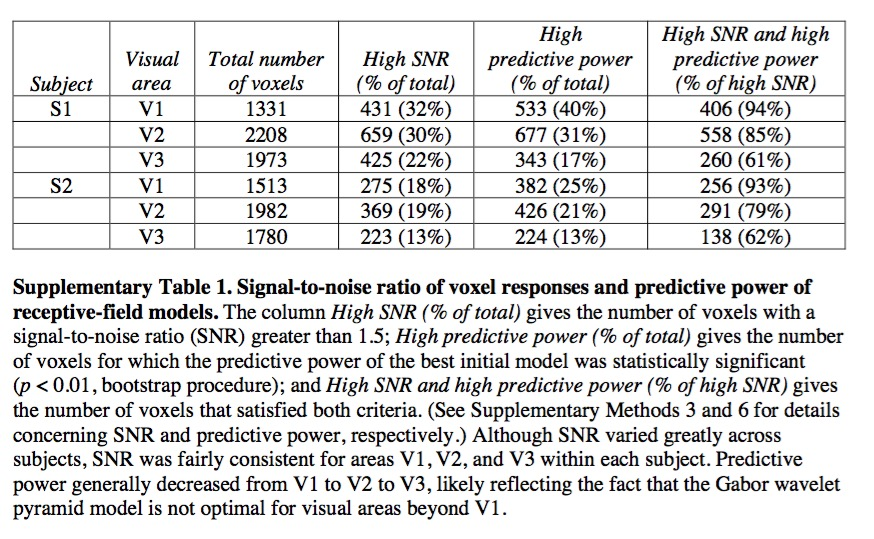

```{r setup, include=FALSE}
knitr::opts_chunk$set(echo = FALSE)
```

# preliminaries

## Topics

- Visual processing in V1
- Object processing
- Perception vs. action
- **"Reading" the mind via fMRI**
- Does neuroscience need behavior?

## Resources

- Course web site: [psu-psychology.github.io/neuro-521-spring-2018](https://psu-psychology.github.io/neuro-521-spring-2018/schedule.html)

## Papers

- {When, If, Although} useful tool for starting an essay, but not obligatory.
- Short essays should have short introductions; put the nuts and bolts in the body.

# main event

## Today's reading

Kay, K. N., Naselaris, T., Prenger, R. J., & Gallant, J. L. (2008). Identifying natural images from human brain activity. *Nature*, *452*(7185), 352–355. https://doi.org/10.1038/nature06713. [Supplemental materials](http://www.nature.com/nature/journal/v452/n7185/extref/nature06713-s1.pdf).

## From static images to dynamic patterns {.smaller}

<iframe width="560" height="315" src="https://www.youtube.com/embed/6FsH7RK1S2E" frameborder="0" allowfullscreen></iframe>

Nishimoto, S., Vu, A. T., Naselaris, T., Benjamini, Y., Yu, B., & Gallant, J. L. (2011). Reconstructing Visual Experiences from Brain Activity Evoked by Natural Movies. Current Biology, 21(19), 1641–1646. <https://doi.org/10.1016/j.cub.2011.08.031>.

---

<div class="centered">
<a href="https://www.nature.com/articles/nature06713/figures/1">

</a>

[Kay et al. 2008](https://doi.org/10.1038/nature06713), Fig 1
</div>

---

<div class="centered">
<a href="https://www.nature.com/articles/nature06713/figures/2">

</a>

[Kay et al. 2008](https://doi.org/10.1038/nature06713), Fig 2
</div>

---

<div class="centered">
<a href="https://www.nature.com/articles/nature06713/figures/3">

</a>

[Kay et al. 2008](https://doi.org/10.1038/nature06713), Fig 3
</div>

---

<div class="centered">
<a href="https://www.nature.com/articles/nature06713/figures/4">

</a>

[Kay et al. 2008](https://doi.org/10.1038/nature06713), Fig 4
</div>
---

<div class="centered">


[Kay et al. 2008](https://doi.org/10.1038/nature06713), Supp Fig 1
</div>

---

<div class="centered">


[Kay et al. 2008](https://doi.org/10.1038/nature06713), Supp Fig 2a
</div>

---

<div class="centered">


[Kay et al. 2008](https://doi.org/10.1038/nature06713), Supp Fig 2b
</div>

---

<div class="centered">


[Kay et al. 2008](https://doi.org/10.1038/nature06713), Supp Fig 9a
</div>

---

<div class="centered">


[Kay et al. 2008](https://doi.org/10.1038/nature06713), Supp Fig 9b
</div>

---

<div class="centered">


[Kay et al. 2008](https://doi.org/10.1038/nature06713), Supp Fig 9c
</div>

---

<div class="centered">


[Kay et al. 2008](https://doi.org/10.1038/nature06713), Supp Fig 3
</div>

---

<div class="centered">


[Kay et al. 2008](https://doi.org/10.1038/nature06713), Supp Fig 4
</div>

---

<div class="centered">


[Kay et al. 2008](https://doi.org/10.1038/nature06713), Supp Fig 10a
</div>

---
<div class="centered">


[Kay et al. 2008](https://doi.org/10.1038/nature06713), Supp Table 1
</div>

## Next time...

- Does neuroscience need behavior?

Krakauer, J. W., Ghazanfar, A. A., Gomez-Marin, A., MacIver, M. A., & Poeppel, D. (2017). Neuroscience needs behavior: Correcting a reductionist bias. *Neuron*, *93*(3), 480–490. Retrieved from http://dx.doi.org/10.1016/j.neuron.2016.12.041
